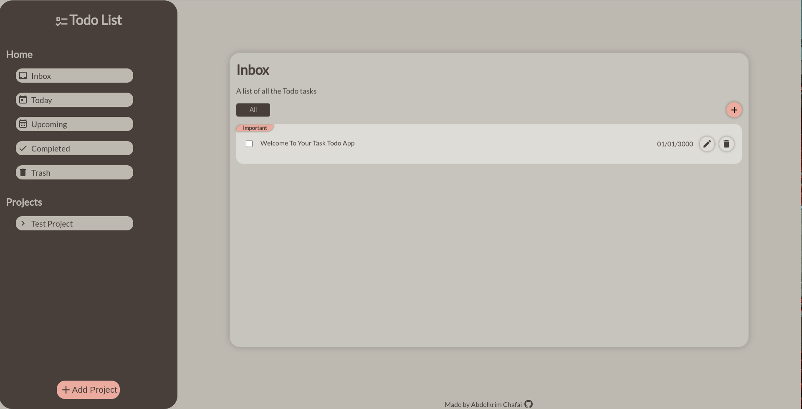

	<h1>Todo List Application
	 
		
		
		
		
		 
	</h1>
	<h3> 👇 Live Demo 👇 </h3>

## 📝 Description
My take on a Todo-List Web Application. 
I builed a Task organizer to keep track of Todo Tasks with the possibility to make custom project folders. 
Ability to sort todos by date and importance.

## 🛠️ Built with
 * HTML5.
 * CSS.
 * Vanilla JavaScript.
 * Webpack.